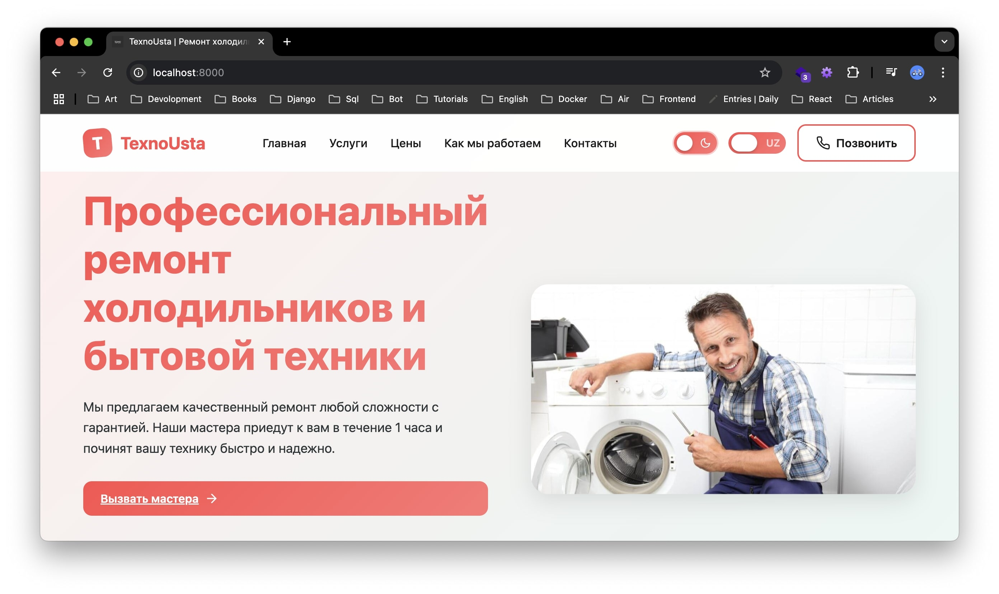
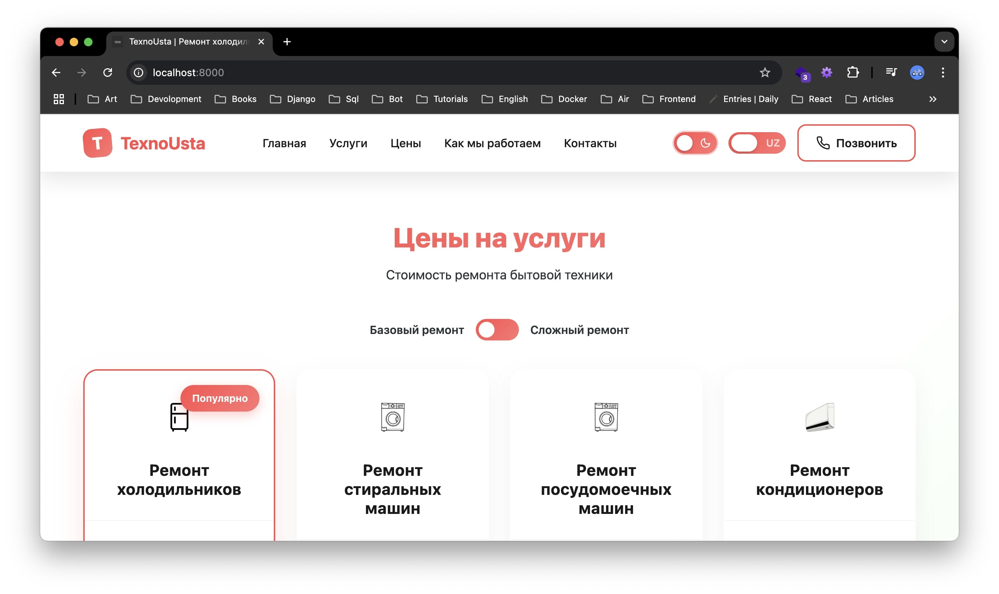
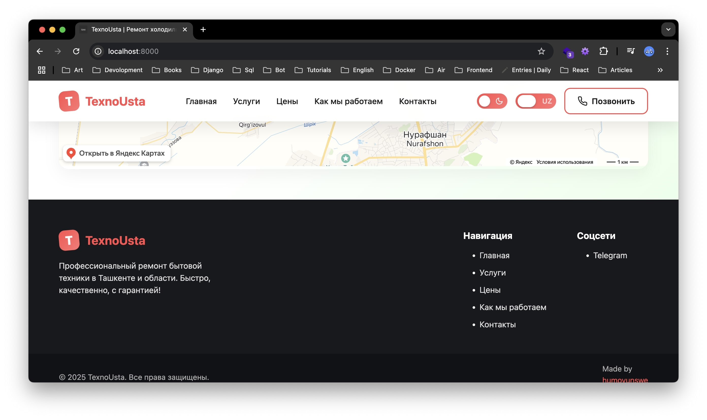

# TexnoUsta - Professional Appliance Repair Service Website

<!-- 

 -->
## About

**TexnoUsta** is a modern, responsive website for a professional appliance repair service based in Tashkent, Uzbekistan. The website offers comprehensive repair services for various household appliances including refrigerators, washing machines, dishwashers, and air conditioners.


### **Multi-language Support**
- **Russian** (Primary language)
- **Uzbek** (Secondary language)
- Dynamic language switching
- Localized content for both languages

### **Dark/Light Theme**
- Toggle between light and dark modes
- Automatic theme persistence
- Smooth theme transitions
- Eye-friendly color schemes

### **Email Notifications**
- Automatic email notifications for new service requests
- SMTP integration for reliable email delivery
- Configurable email settings
- Admin dashboard for managing requests

### Quick Start
1. **Clone the repository**
  ```bash
  git clone https://github.com/humoyuswe/TexnoUsta.git
  cd TexnoUsta
  ```

2. **Install dependencies**
  ```bash
  pip install -r requirements.txt
  ```

3. **Configure SMTP settings** (see `SMTP_SETUP.md` for detailed instructions)
   - Update email settings in `core/settings.py`
   - Set your email and app password
   - Test SMTP configuration with `python test_smtp.py`

4. **Run migrations**
  ```bash
  python manage.py migrate
  ```

5. **Start the development server**
  ```bash
  python manage.py runserver
  ```